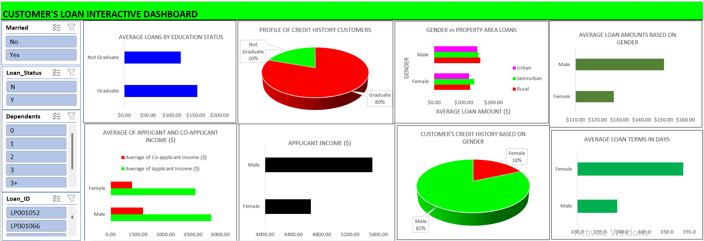

# Customers Loan Insights
This interactive dashboard analyzes loan application data to reveal insights on customer profiles, income, loan status, and approval trends. It highlights gender and education-based patterns, offering financial institutions a clear, visual summary of applicant behavior and loan decisions.

**Title:** [Customers Loan Insights](https://github.com/Osiwi/github.io/blob/main/Loan_Sanction_Cleaned.xlsx)

**Tools & Technologies Used:** 
Microsoft Excel: Primary platform for data analysis and dashboard development.
Pivot Tables & Pivot Charts: Used to dynamically summarize income, loan status, credit history, and demographic data.
Slicers & Filters: Enable user interactivity by filtering based on gender, marital status, dependents, loan status, and loan ID.
Conditional Formatting: Highlights key values such as loan amounts and incomes.
Form Controls: Provides a user-friendly interface for data segmentation.
Power Query (Get & Transform): Used for cleaning and preparing raw loan data before analysis.
Chart Types: Includes pie charts, bar charts, and clustered columns for visual insights.

**Project Description Overview:**
Customers Loan Interactive Dashboard: This interactive dashboard was created to analyze loan application data and uncover key insights related to customer profiles, income levels, loan status, and approval trends. Designed for financial institutions and stakeholders, the dashboard provides a user-friendly visual summary of applicant behavior, gender-based patterns, and education-level influences on loan approval and terms.

**Objective:**
To provide a data-driven overview of loan applicants by visualizing income levels, education status, gender influence, property area distribution, credit history, and loan decisions, enabling stakeholders to identify approval trends and risk indicators.

**Key Features Included in the Dashboard:**
Average Loans by Education Status: Bar chart comparing loan amounts between graduates and non-graduates.
Credit History Profile: Pie chart showing the ratio of graduates in the customer base with credit history.
Gender vs Property Area: Horizontal bar chart showing how gender and area (urban, rural, semiurban) relate to average loan amounts.
Average Loan Amounts by Gender: Male applicants request higher average loans than female applicants.
Applicant & Co-applicant Income Analysis: Income distribution by gender, comparing applicant vs. co-applicant.
Customer Credit History by Gender: 82% of applicants with credit history are male.
Loan Term Duration by Gender: Females have slightly longer average loan terms in days.

**Key findings:**
Graduates dominate the credit history group (80%), suggesting a strong correlation between education and credit access.
Male applicants make up 82% of those with a credit history, indicating possible gender-based approval biases or trends.
Male applicants tend to have higher average loan amounts and incomes, suggesting stronger loan eligibility or confidence in applying.
Semiurban areas show slightly higher average loan values, especially among male applicants.
Females have slightly longer loan terms, which may imply different repayment strategies or loan structuring.

**Dashboard Overview:** 

